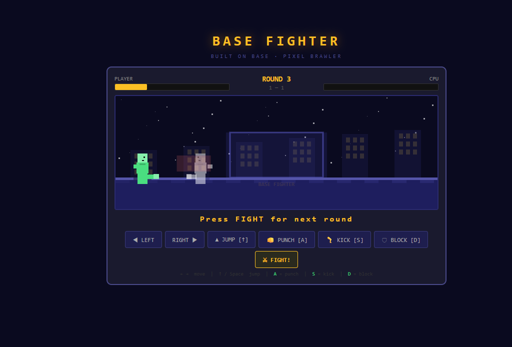

# ⚔️ BASE FIGHTER

A retro pixel art fighting game built on Base. Single player vs AI, fully browser-based — no installs, no libraries, just one HTML file.



## 🎮 Play

**[▶ Live Demo](https://base-fighter.vercel.app)**

## Controls

| Action | Key |
|--------|-----|
| Move Left | ← |
| Move Right | → |
| Jump | ↑ or Space |
| Punch | A |
| Kick | S |
| Block | D |

Mobile touch buttons included.

## Features

- Pixel art characters & arena
- Player vs AI with adaptive difficulty
- Health bars + round system + score tracker
- Sound effects (Web Audio API)
- Block mechanic (reduces damage)
- Mobile friendly (touch controls)
- Zero dependencies — single `index.html`

## Built With

- HTML5 Canvas
- Vanilla JavaScript
- Web Audio API
- Deployed on [Vercel](https://vercel.com)
- Registered on [Base](https://base.dev) via Builder Code

## 🔵 Base Integration

This app is registered as a BaseApp on Base.  
Builder Code tracks engagement and qualifies for [Base Builder Rewards](https://base.dev).

## Run Locally

```bash
git clone https://github.com/YOUR_USERNAME/base-fighter
cd base-fighter
# open index.html in your browser
```

---

Built by [@tzogirl](https://x.com/tzogirl) · Powered by Base
